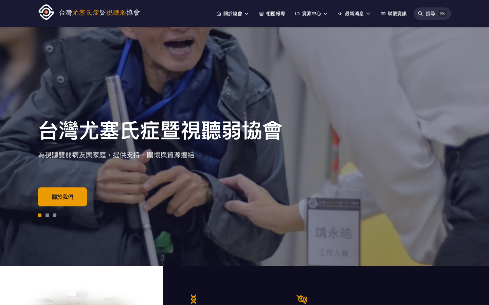

# Taiwan Usher Syndrome and Audiovisual Impairment Association
### 台灣尤塞氏症暨視聽弱協會

The official website of a Taiwanese nonprofit serving people living with Usher
syndrome, a genetic condition that causes progressive vision loss together with
hearing loss.

**Live site: [www.usher.org.tw](https://www.usher.org.tw)**



---

## About the association

The association was founded in July 2023 by a group that had until then been
scattered: patients, parents, medical practitioners and academics researching the
condition, and members of the public who cared about it. Members live with
retinitis pigmentosa together with hearing loss, most often caused by Usher
syndrome. The defining fact of their situation is that both senses are affected
at once, which rules out the usual accommodations. A deaf person can read. A
blind person can listen. Someone with Usher syndrome gradually loses access to
both.

The charter commits the association to helping patients and families in Taiwan
obtain proper medical, genetic, academic and social-welfare support. Its eight
formal tasks reduce to four themes:

- Advocating for members' rights and public entitlements
- Supporting members' physical health, mental health and wellbeing
- Connecting families with services, funding and other affected households
- Raising public understanding, tracking research progress, and building ties
  with counterpart organisations abroad

The association is legally incorporated and registered with Taiwan's Ministry of
the Interior. Its incorporation certificate, registration certificate and
approval letter are published on the site.

## Contribution to the Usher syndrome ecosystem

**The gap this fills.** Usher syndrome is rare, and deafblindness makes the
affected population both small and hard to reach. Reliable information in
Traditional Chinese has been scarce. Before 2023, Taiwanese patients and their
families had no national organisation of their own, which meant no shared
reference point, no collective voice, and for many families the belief that they
were the only ones.

**What this repository contributes:**

1. **A durable, citable Chinese-language reference point.** 27 published items
   across four content types: 協會文件 (resources), 部落格 (blog), 事務公告
   (notices) and 相關報導 (related news coverage), all served as permanent,
   indexable URLs rather than posts buried in a social feed.

2. **An introduction to the condition, plus expert perspectives.** The resource
   centre carries a plain-language explainer (什麼是尤塞氏症？), an account of the
   difficulties patients face, and contributed perspectives from an
   ophthalmologist (眼科醫師觀點) and a special-education teacher (特教老師觀點) —
   the clinical and educational context a Taiwanese family is otherwise left to
   assemble from English-language sources.

3. **First-person accounts from patients and parents** (病友經驗分享, `/story`
   病友故事). This is what a newly diagnosed family searches for, and in Chinese
   it is largely absent from the web.

4. **Practical guidance on welfare and daily life** (`/guides` 建議與指引,
   社會福利資源, 媒體宣傳資源), including a guide to using speech-to-text tooling —
   assistive technique shared rather than kept in one household.

5. **Public tracking of research and media coverage** (`/related-news`), which is
   one of the association's chartered tasks carried out in the open rather than
   circulated internally.

6. **Verifiable institutional transparency.** `/about` publishes the association's
   registering authority, unified business number, incorporation letter number
   and legal-person registration number, alongside the certificates themselves.
   Documents are served through a versioned system that records version numbers,
   file hashes and upload dates, so an external body can confirm it is reading
   the current text. Young rare-disease organisations are routinely asked to
   prove legitimacy; this makes that self-service.

7. **A reusable accessibility reference.** The design decisions for a deafblind
   audience, the contrast audit that failed, and the fixes applied are all
   documented in the open in [`ACCESSIBILITY_PLAN.md`](ACCESSIBILITY_PLAN.md) and
   in the section below. Another small disability organisation can copy the
   patterns instead of rediscovering them, or repeating the same mistakes.

8. **An architecture a volunteer-run nonprofit can actually afford.** The site
   compiles to static files with no server to keep alive, which keeps hosting
   close to free, holds up on poor connections, and does not fall over when a
   backend goes down.

## Accessibility is the requirement, not a feature

The people this site is built for are losing vision and hearing at the same time.
Neither a visual nor an audio fallback can be assumed to work. That constraint
drove the following, all of which are in the codebase now:

| Implemented | Where |
|---|---|
| Skip-to-content link, labelled in Chinese | `src/app/layout.tsx:54` |
| 4px high-contrast focus ring with 4px offset on every focusable element | `src/app/globals.css:48` |
| ARIA landmarks and descriptive labels throughout | 23 page and component files |
| Carousel exposed as a labelled `role="region"` with `aria-roledescription`, and real `<button>` pagination controls rather than clickable `<div>`s | `src/components/HeroSlider.tsx:61,84` |
| Navigation dropdowns as real `<button>` elements with `aria-expanded` and `aria-haspopup`, toggled on click rather than hover alone | `src/components/Header.tsx:143` |
| Screen-reader-only captions and labels on the governance document tables | `src/app/about/page.tsx:105` |
| External links announce that they open in a new window, instead of relying on a visual icon | `src/components/MarkdownRenderer.tsx:49` |
| Fluid `clamp()` type scale and 1.625 body line-height for low-vision reading | `src/app/globals.css` |
| Generous touch and reading margins on small screens | `.content-padding-x` in `src/app/globals.css` |
| Client-side search with Traditional Chinese word segmentation, so content is reachable without navigating the menus | Pagefind, indexed at build |
| `prefers-reduced-motion` support — animations and autoplay disable, smooth scrolling is turned off | `src/components/HeroSlider.tsx:34`, `src/app/globals.css:136` |

An audit found white text on the orange accent colour failing badly at a 1.98:1
contrast ratio. Rather than abandon the brand colour, the pairing was inverted:
dark text on orange measures 10.6:1, which passes WCAG AAA. The reasoning is
recorded in [`ACCESSIBILITY_PLAN.md`](ACCESSIBILITY_PLAN.md).

The target standard is WCAG 2.1 AA.

### Still to do

Accessibility work here is ongoing rather than finished:

- Automated axe checks wired into CI so regressions fail the build
- A full screen-reader pass with VoiceOver and NVDA, ideally with members of the
  association rather than only developers

## Architecture

Next.js 16 (App Router), React 19, Tailwind CSS 4, TypeScript.

Content is authored in a Laravel headless CMS and pulled in at build time. The
deployed site is **entirely static** — there is no runtime dependency on the CMS.
When an editor publishes, the CMS calls a webhook that invalidates only the
affected cache tags, so updates appear without a full rebuild.

This is a deliberate choice for an organisation with no full-time engineering
staff: nothing to monitor at 3am, nothing that breaks when the backend is down,
and hosting costs that stay near zero.

| Route | Description |
|---|---|
| `/` | Homepage |
| `/about` | About the association (創立目的) |
| `/contact` | Contact and community channels (聯繫資訊) |
| `/story`, `/story/[slug]` | Patient and family stories (病友故事) |
| `/guides`, `/guides/[slug]` | Care and resource guidance (建議與指引) |
| `/blog`, `/blog/[slug]` | Blog (部落格) |
| `/notice`, `/notice/[slug]` | Notices (事務公告) |
| `/document`, `/document/[slug]` | Resource centre, with document version history (協會文件) |
| `/related-news`, `/related-news/[slug]` | Related news coverage (相關報導) |
| `/[pageSlug]` | Static pages (structure, message, logo-represent) |
| `/research` | Permanent redirect to `/document` |
| `/api/revalidate` | Webhook for on-demand cache invalidation |

The site carries `sitemap.xml`, `robots.txt`, Open Graph and Twitter metadata,
and JSON-LD structured data for the organisation, articles and pages.

## Content and privacy

All content is written in Traditional Chinese by association staff through the
CMS, and the site declares `lang="zh-TW"`. This README is in English for the
benefit of people outside Taiwan; the site itself is not translated.

The public site sets no analytics, no third-party trackers and no advertising
scripts. The only external references in the source are outbound links to the
association's own public Facebook group and LINE community. Downloadable
attachments are association documents, not personal data.

## Development

Requires Node.js 24 and, for fresh content, the Laravel CMS on port 8001.

```bash
npm install
npm run dev     # hot reload, needs the CMS running
npm run build   # static build + search index
npm run start   # serve the built site, no CMS needed
```

Full setup, environment variables, content sources and the revalidation webhook
are documented in [`docs/DEVELOPMENT.md`](docs/DEVELOPMENT.md).

## Contributing

Reports of anything that is unreachable by keyboard, unreadable at high zoom, or
unannounced by a screen reader are the most valuable contribution anyone can
make here. See [`CONTRIBUTING.md`](CONTRIBUTING.md), which also sets out the
accessibility requirements any UI change has to meet, and
[`CODE_OF_CONDUCT.md`](CODE_OF_CONDUCT.md).

## Licence and contact

Released under the [MIT Licence](LICENSE). If you work with a disability
organisation and want to reuse the accessibility patterns here, please do — and
get in touch if it would help to talk them through.

Contact the association through the channels listed at
[www.usher.org.tw/contact](https://www.usher.org.tw/contact).
